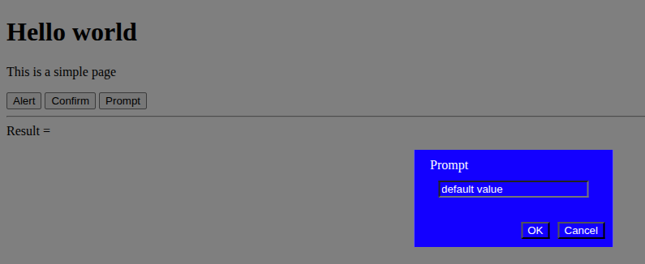
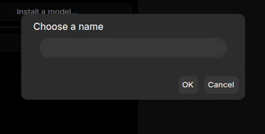

# yupee-dialogs

This is a simple dialogs framework for the Yupee library. It can be used without the Yupee Library too (look at the test folder).

This framework can be used for electron usage.

You have 3 default dialogs usage :

```javascript
$$.dialogs.alert
$$.dialogs.prompt
$$.dialogs.confirm
```

Each dialog is asynchronous for general usage like electron usage. Here a very simple case for a prompt value.

```javascript
async myPrompt() {
    const news = await $$.dialogs.prompt( "What's new ?", "default value..." );
    console.log( news );
}
```

You have two dialogs types :

## Native dialogs

This is the default dialogs for Yupee. You just have to put the yupee-native-dialogs.js after the yupee.js library.

```html
<!DOCTYPE html>
<html>
    <head>
        <script src='yupee.js'></script>
        <script src='yupee-native-dialogs.js'></script>
    </head>
    ...
</html>
```

## Inner dialogs

This is inner dialogs for Yupee. You just have to put the yupee-inner-dialogs.js after the yupee.js library.

This is very useful for electron usage.

```html
<!DOCTYPE html>
<html>
    <head>
        <script src='yupee.js'></script>
        <script src='yupee-inner-dialogs.js'></script>
    </head>
    ...
</html>
```

# Updating the look and feel

Your inner dialog adds a **yupee_dialog** class for the dialog panel. Thus you may update the look like in this sample for having blue dialog. You may also update the look for any fields like button/input...



Here an example for the blue background

```html
<style type="text/css">
	div.yupee_dialog * {
		background-color:blue;
		color:white;
	}
	div.yupee_dialog button {
	}
</style>
```



Here an example for default electron background

```html
<script type="text/css">
	div.yupee_dialog, div.yupee_dialog div {
    		border-radius: 10px;    
	}

	div.yupee_dialog,div.yupee_dialog * {
		 background-color:#2c2c2c !important;    
		color:white;
	}

	div.yupee_dialog button, div.yupee_dialog input {
		background:#373737 !important;
		color:white;
	}
</script>
```

(c) Alexandre Brillant
