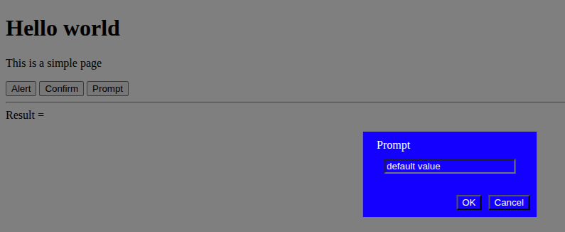
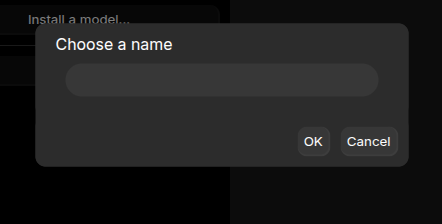
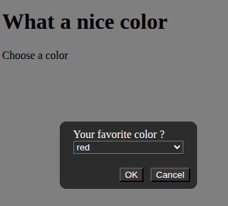
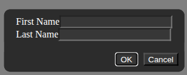

# yupee-dialogs

This is a simple dialogs framework for the [Yupee library](https://github.com/AlexandreBrillant/yupee). It can be used without the Yupee Library too (look at the test folder).

This framework can be used for electron usage.

You have 3 default dialogs usage :

```javascript
$$.dialogs.alert
$$.dialogs.prompt
$$.dialogs.confirm
$$.dialogs.panel
```

Each dialog is asynchronous for general usage like electron usage. Here a very simple case for a prompt value.

```javascript
async myPrompt() {
    const news = await $$.dialogs.prompt( "What's new ?", "default value..." );
    console.log( news );
}
```

You have two dialogs types :

## Native dialogs

This is the default dialogs for Yupee. You just have to put the yupee-native-dialogs.js after the yupee.js library.

```html
<!DOCTYPE html>
<html>
    <head>
        <script src='yupee.js'></script>
        <script src='yupee-native-dialogs.js'></script>
    </head>
    ...
</html>
```

## Inner dialogs

This is inner dialogs for Yupee. You just have to put the yupee-inner-dialogs.js after the yupee.js library.

This is very useful for electron usage.

```html
<!DOCTYPE html>
<html>
    <head>
        <script src='yupee.js'></script>
        <script src='yupee-inner-dialogs.js'></script>
    </head>
    ...
</html>
```

# Updating the look and feel

Your inner dialog adds a **yupee_dialog** class for the dialog panel. Thus you may update the look like in this sample for having blue dialog. You may also update the look for any fields like button/input...



Here an example for the blue background

```html
<style type="text/css">
	div.yupee_dialog * {
		background-color:blue;
		color:white;
	}
	div.yupee_dialog button {
	}
</style>
```



Here an example for default electron background

```html
<style type="text/css">
	div.yupee_dialog, div.yupee_dialog div {
    		border-radius: 10px;    
	}

	div.yupee_dialog,div.yupee_dialog * {
		 background-color:#2c2c2c !important;    
		color:white;
	}

	div.yupee_dialog button, div.yupee_dialog input {
		background:#373737 !important;
		color:white;
	}
</style>
```

# Calling inner dialogs without yupee

In this example, we use the yupee-dialogs without usage of the yupee library. By default, all the dialogs
are stored inside the window.dialogs object.

```html
<!DOCTYPE html>
<html>
    <head>
        <style type="text/css">
            div.yupee_dialog, div.yupee_dialog div {
                    border-radius: 10px;    
            }

            div.yupee_dialog,div.yupee_dialog * {
                background-color:#2c2c2c !important;    
                color:white;
            }

            div.yupee_dialog button, div.yupee_dialog input {
                background:#373737 !important;
                color:white;
            }
        </style>
        <script src="../src/yupee-inner-dialogs.js"></script>
        <script>
            const init = async () => {
                console.log( await dialogs.confirm( "Are you sure ?" ) );
                console.log( await dialogs.prompt( "Your value ?", "default value" ) );
                console.log( await dialogs.alert( "Hello World" ) );
            };
            document.addEventListener( "DOMContentLoaded", init )
        </script>
    </head>
    <body>

        <h1>Hello world</h1>

        <p>
            This is a simple page with 3 inner dialogs
        </p>

    </body>
</html>
```

# List case

Rather than prompting a default string value, it is possible to choose an array of string. Thus a select field
will replace an input field automatically.



In this example, we display a color choosed by the user. Note that the default value stored the selected value. The
first one (here red) is the default one.

```javascript
    console.log( await dialogs.prompt( "Your favorite color ?", [ "red", "yellow", "green", "blue" ] ) );
```

# Using a panel

A panel is a free container element, like a "DIV". You can put anything inside like a complex form. You can choose the default "Ok", "Cancel" actions or set your own actions. You can also control the way the container is displayed with your own CSS properties.

In this example, we have a panel with two fields "firstname" and "lastname". In the first dialog, we use the default actions "Ok" and "Cancel". In the second dialog, we update the size and the actions.



```javascript

const panel = document.createElement( "DIV" );
panel.innerHTML = "<div><label>First Name</label><input type='text' name='firstname'></div>";
panel.innerHTML += "<div><label>Last Name</label><input type='text' name='lastname'></div>";


const button = await dialogs.panel( panel );
if ( button == "OK" ) {
    alert( "Hello " + panel.querySelector( "[name=firstname]").value + "," +
        panel.querySelector( "[name=lastname]").value );
}

// We update the default CSS config of the main container
const button2 = await dialogs.panel( panel.cloneNode(true), { actions: [ "Yes", "No" ], minWidth:"300px", minHeight:"300px", top:"300px" } );
if ( button2 == "Yes" ) {
    alert( "OK Mister" );
} else
if ( button2 == "No" ) {
    alert( "Oh Really ?" );
}

```

(c) 2026 Alexandre Brillant
